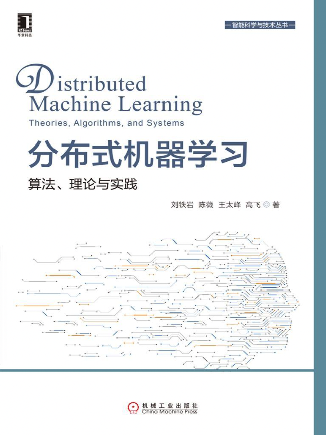

<!--
 * @Descripttion: 
 * @Version: 1.0
 * @Author: ZhangHongYu
 * @Date: 2022-07-02 11:00:07
 * @LastEditors: ZhangHongYu
 * @LastEditTime: 2022-07-02 15:15:19
-->

# 分布式机器学习
📚 *如果船长的最高目标是保住他的船，那么他只能永远待在港口。*

 
 
  

## 1 简介
本项目为经典分布式机器学习算法的的PySpark/Pytorch实现, 主要参考了刘铁岩的《分布式机器学习》和[CME 323: Distributed Algorithms and Optimization](https://stanford.edu/~rezab/classes/cme323/S17/)课程。主要内容包括图/矩阵计算（graph/matrix computation）、随机算法、优化（optimization）和机器学习。

## 2 目录

- 图计算
    - PageRank  [[explanation]](https://www.cnblogs.com/orion-orion/p/16340839.html)
    - Transitive Closure
- 机器学习
    - K-means
    - Logistic Regression  [[explanation]](https://www.cnblogs.com/orion-orion/p/16318810.html)
- 矩阵计算
    - Matrix Decomposition
- 数值优化
  - 同步算法 
    - Synchronous Stochastic Gradient Descent (SSGD) [[explanation]](https://www.cnblogs.com/orion-orion/p/16413182.html) [[paper]](https://proceedings.neurips.cc/paper/2010/file/abea47ba24142ed16b7d8fbf2c740e0d-Paper.pdf)
      -  SSGD in Pytorch [[explanation]](https://www.cnblogs.com/orion-orion/p/16413182.html) [[paper]](https://proceedings.neurips.cc/paper/2010/file/abea47ba24142ed16b7d8fbf2c740e0d-Paper.pdf)
    - Model Average (MA) [[explanation]](https://www.cnblogs.com/orion-orion/p/16426982.html) [[paper]](https://aclanthology.org/N10-1069.pdf)
    - Block-wise Model Update Filtering (BMUF) [[explanation]](https://www.cnblogs.com/orion-orion/p/16426982.html) [[paper]](https://www.microsoft.com/en-us/research/wp-content/uploads/2016/08/0005880.pdf)
    - Elastic Averaging Stochastic Gradient Descent  (EASGD) [[explanation]](https://www.cnblogs.com/orion-orion/p/16426982.html) [[paper]](https://proceedings.neurips.cc/paper/2015/file/d18f655c3fce66ca401d5f38b48c89af-Paper.pdf)
  - 异步算法
    - Synchronous Stochastic Gradient Descent (ASGD)[[explanation]](https://www.cnblogs.com/orion-orion/p/17118029.html) [[paper]](https://proceedings.neurips.cc/paper/2011/file/f0e52b27a7a5d6a1a87373dffa53dbe5-Paper.pdf)
    - Hogwild! [[explanation]](https://www.cnblogs.com/orion-orion/p/17118029.html) [[paper]](https://proceedings.neurips.cc/paper/2011/file/218a0aefd1d1a4be65601cc6ddc1520e-Paper.pdf)
- 随机算法
    - Monte Carlo Method
